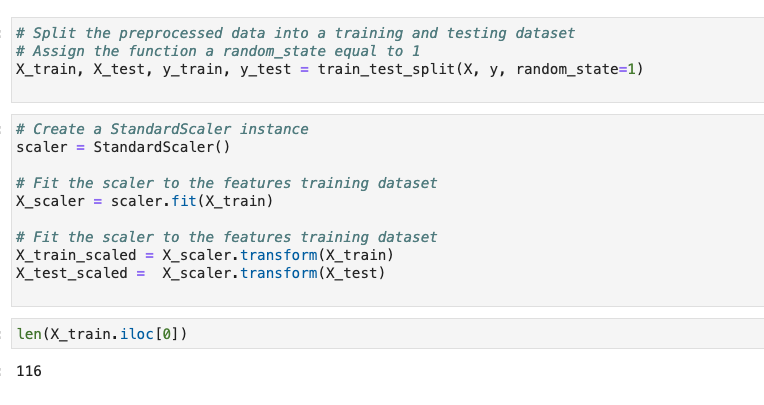
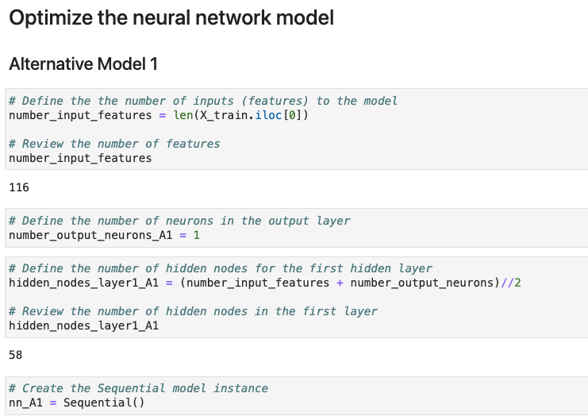
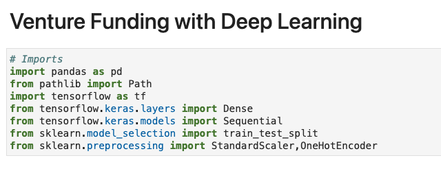
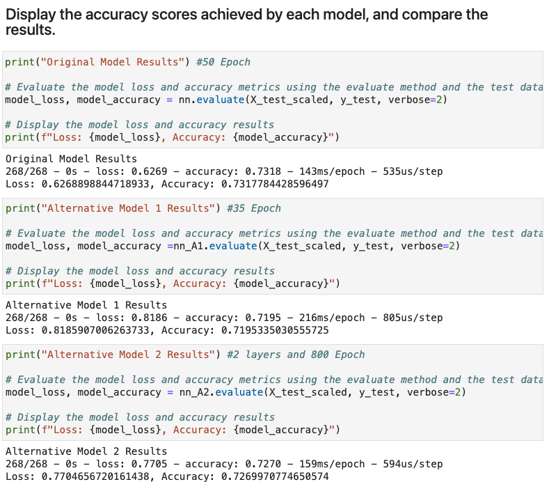

# venture_funding_with_deep_learning
# Overview

This is a Jupyter notebook whose purpose is create a model that predicts whether Alphabet Soup 

funding applicants will be successful, with a binary classification model using a deep neural 

network.

consists of three technical deliverables:

Preprocess data for a neural network model.

Use the model-fit-predict pattern to compile and evaluate a binary classification model.

Optimize the model.

---

## Technologies

This setup assumes you already have conda installed.

This project leverages python 3.7 with the following packages:

---

## Results

---
## Contributors

Israel Fernandez

---
